# 🏔️ Hill Explorer – Tourism Information and Online Booking Management System

A web-based tourism platform developed using Angular that allows users to explore popular hill stations in India, view detailed destination information, book hotels and tours, and complete a simulated payment flow.

---

## 🌄 Project Overview

**Hill Explorer** is a tourism and online booking web application designed to provide users with an easy and interactive way to discover hill stations across India.

The application provides destination exploration, detailed place information, hotel booking, tour booking, user authentication, contact services, feedback submission, and a simulated payment workflow.

The project focuses on creating an interactive and user-friendly tourism experience using Angular, TypeScript, HTML, and CSS.

---

## ✨ Features

### 🏠 Home Page

- Attractive hero section
- Hill station introduction
- Popular destinations
- Traveler reviews
- Contact information

### 🌍 Destinations

- Explore multiple hill stations across India
- Search destinations
- Filter destinations by category
- Sort destinations by popularity
- Sort destinations by rating
- Sort destinations by price
- Pagination
- Destination cards with ratings and visitor information

### 📍 Place Details

- Detailed destination information
- Destination images
- Location map
- Package price
- Hotel price per night
- Direct hotel booking option

### 🏨 Hotel Booking

- Select check-in and check-out dates
- Select number of rooms
- Select adults and children
- Choose room type:
  - Standard Room
  - Deluxe Room
  - Suite
- Automatic booking summary
- Dynamic total price calculation
- Continue to payment

### 🎒 Tour Booking

- Select destination
- Display tour price
- Enter traveler details
- Enter email and phone number
- Select travel date
- Select adults and children
- Automatic traveler count
- Continue to payment

### 💳 Payment

- Booking amount display
- Selected room information
- UPI payment option
- QR code payment option
- Payment completion button
- Booking confirmation page

> **Note:** The payment functionality in this project is implemented as a demonstration/simulation and is not connected to a real payment gateway.

### 🔐 User Authentication

- Sign Up page
- Sign In page
- Username and password fields
- User registration form

### 📞 Contact

- Contact form
- Email and mobile details
- Location map
- Message submission confirmation

### ⭐ Feedback

- User feedback form
- Rating selection
- Feedback submission
- Thank-you confirmation

---

## 🛠️ Technologies Used

### Frontend

- Angular
- TypeScript
- HTML5
- CSS3

### Development Tools

- Angular CLI
- Visual Studio Code
- Git
- GitHub

---

## 📂 Project Structure

```text
Tourism-Information-and-Online-Booking-Management-System/
│
├── screenshots/
│   ├── home-1.png
│   ├── home-2.png
│   ├── home-3.png
│   ├── destination-1.png
│   ├── destination-2.png
│   ├── place-details.png
│   ├── hotel-booking.png
│   ├── payment.png
│   ├── success.png
│   ├── tour-booking.png
│   └── contact.png
│
├── src/
│   ├── app/
│   │   ├── home/
│   │   ├── destinations/
│   │   ├── place-details/
│   │   ├── navbar/
│   │   ├── contact/
│   │   ├── feedback/
│   │   ├── signin/
│   │   ├── signup/
│   │   ├── payment/
│   │   ├── success/
│   │   └── pages/
│   │       ├── book-hotel/
│   │       └── book-tour/
│   │
│   ├── assets/
│   │   └── images/
│   │
│   ├── index.html
│   ├── main.ts
│   └── styles.css
│
├── angular.json
├── package.json
├── package-lock.json
├── tsconfig.json
├── .gitignore
└── README.md
```

---

## 🚀 Getting Started

Follow the steps below to run the project locally.

### 1. Clone the Repository

```bash
git clone https://github.com/Chandana-Adelli/Tourism-Information-and-Online-Booking-Management-System.git
```

### 2. Navigate to the Project Directory

```bash
cd Tourism-Information-and-Online-Booking-Management-System
```

### 3. Install Dependencies

```bash
npm install
```

### 4. Start the Development Server

```bash
ng serve
```

### 5. Open the Application

After the development server starts, open your browser and visit:

```text
http://localhost:4200
```

---

## 🖥️ Application Flow

The main hotel booking flow of the application is:

```text
Home
  ↓
Destinations
  ↓
Place Details
  ↓
Hotel Booking
  ↓
Payment
  ↓
Booking Confirmation
```

Users can also access the following sections from the application:

```text
Home
├── Destinations
├── Book Tour
├── Contact
├── Sign Up
├── Sign In
└── Feedback
```

---

## 📸 Screenshots

### 🏠 Home Page

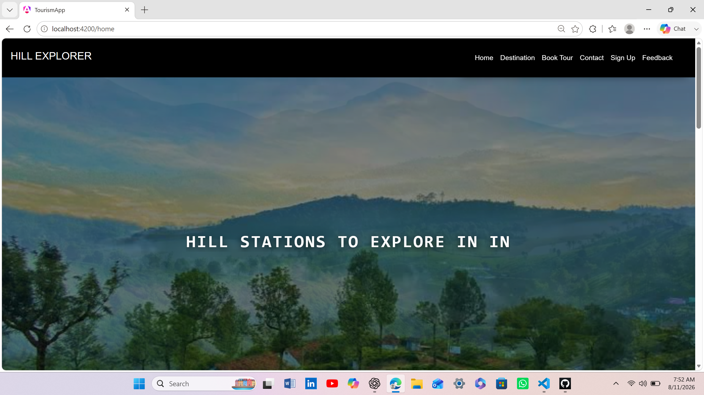

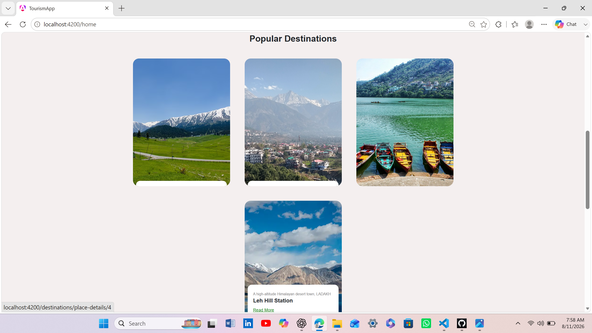

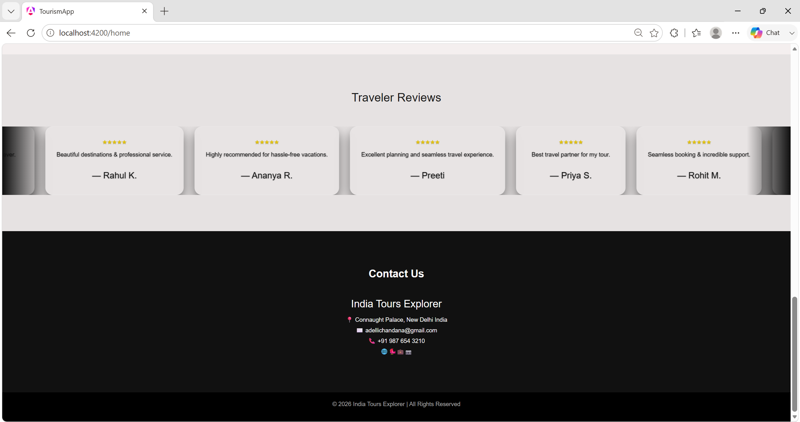

---

### 🌍 Destinations

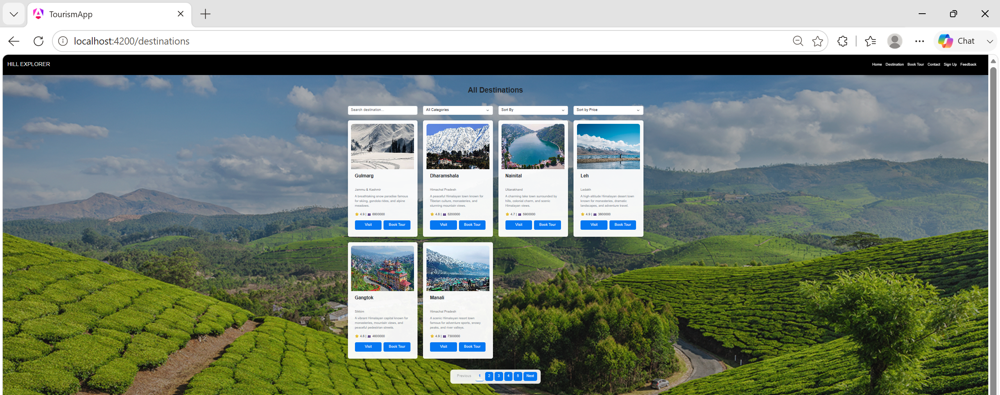

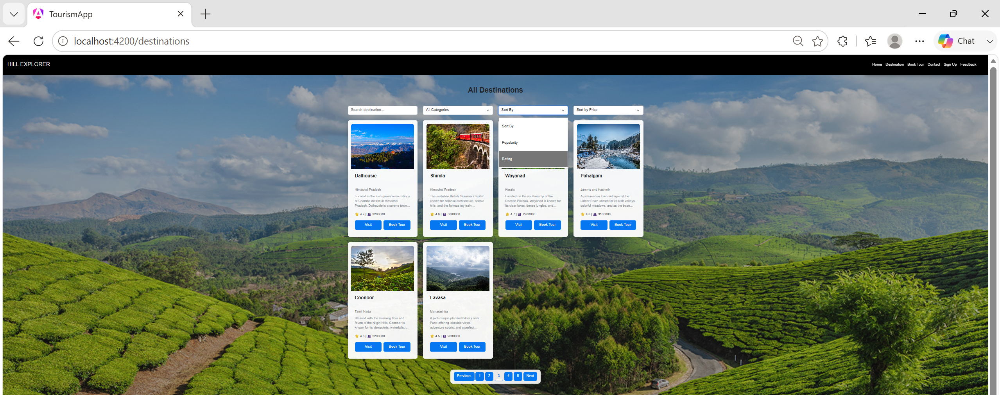

---

### 📍 Place Details

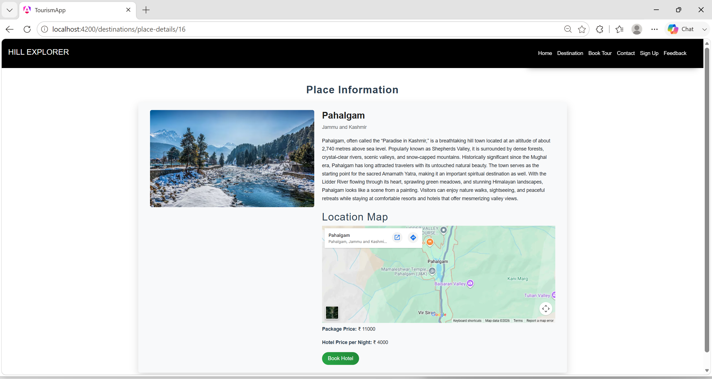

---

### 🏨 Hotel Booking

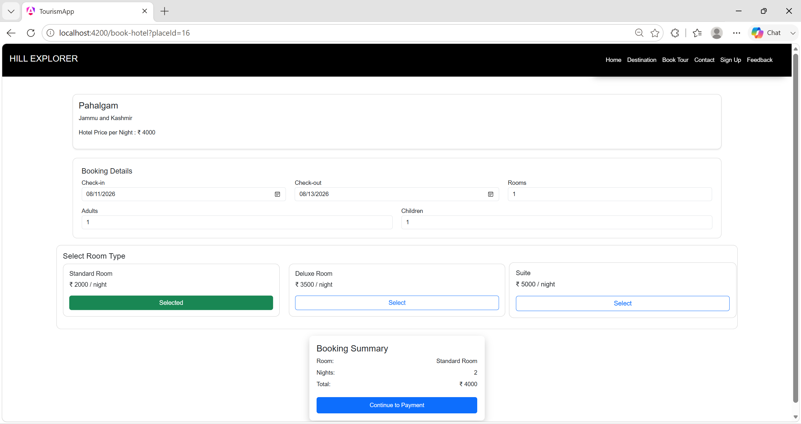

---

### 💳 Payment

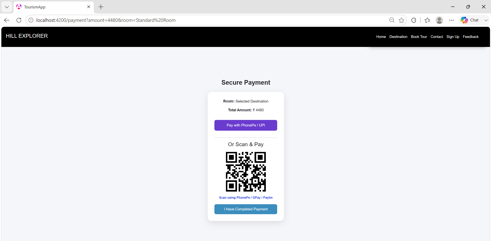

---

### ✅ Booking Confirmation

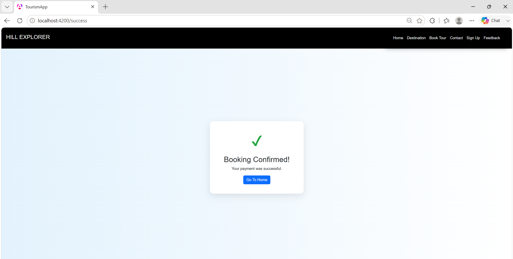

---

### 🎒 Tour Booking

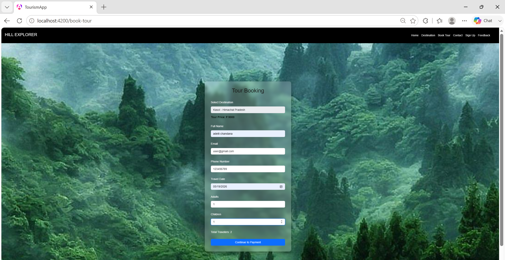

---

### 📞 Contact

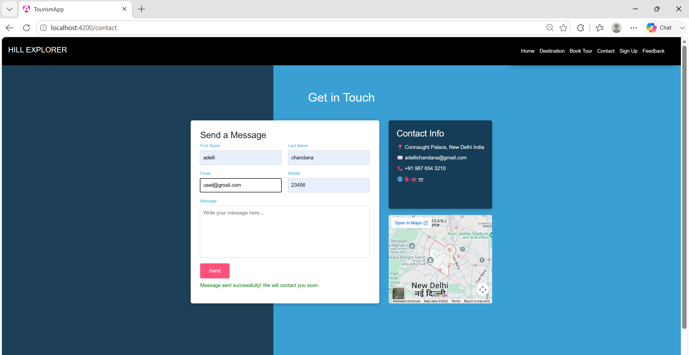

---

## 🎯 Key Learning Outcomes

Through this project, I gained practical experience in:

- Angular component-based development
- Angular routing
- TypeScript programming
- HTML and CSS development
- Dynamic data rendering
- Form handling
- Destination filtering and sorting
- Pagination
- Hotel booking workflow implementation
- Tour booking workflow implementation
- Dynamic price calculation
- Payment workflow design
- User interface development
- Responsive web interface development
- Git and GitHub version control

---

## 💡 Project Highlights

- Interactive tourism website focused on hill stations in India
- Destination exploration with search, filtering, sorting, and pagination
- Detailed destination information with location maps
- Hotel booking workflow with different room types
- Tour booking functionality
- Dynamic booking price calculation
- Simulated UPI and QR-based payment flow
- Booking confirmation page
- User authentication pages
- Contact and feedback functionality
- Clean and interactive user interface

---

## 👩‍💻 Developed By

**Chandana Adelli**

**B.Tech – Computer Science Engineering**  
**Specialization: Artificial Intelligence & Machine Learning**

---

## 🎓 Internship Project

This project was developed as part of the **Infosys Springboard Internship 6.0**.

---

## 📌 Project

**Hill Explorer – Tourism Information and Online Booking Management System**

A tourism web application designed to provide users with an interactive platform to explore hill stations, view destination information, book hotels and tours, and experience a simulated online payment workflow.

---

## 🔗 Repository

GitHub Repository:

https://github.com/Chandana-Adelli/Tourism-Information-and-Online-Booking-Management-System